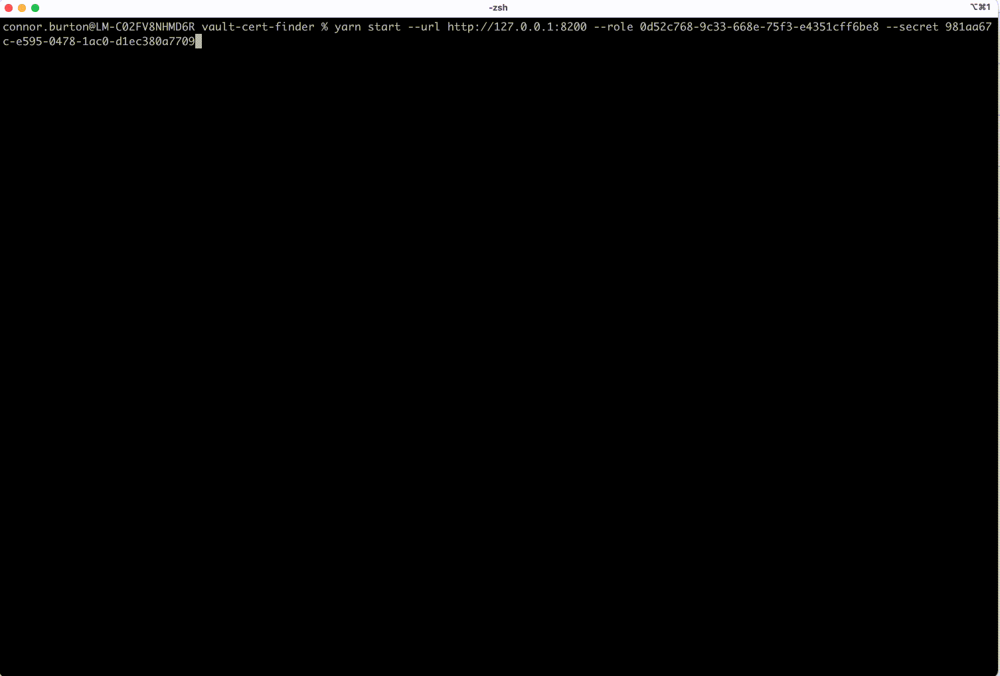

# Vault Cert Finder

This tool finds, parses and outputs X509 certificates stored in a [Hashicorp Vault](https://www.vaultproject.io/).



## Security

This tool deals directly with secrets in Vault and will iterate over and retrieve every secret your approle has access to. With this in mind, there are some security precautions to take before you run this script.

- You are communicating with Vault over HTTPS.
- You are running this on a secure machine, ideally your local machine. It's not recommended to run this in any CI environment as it may be insecure.
- Some [debug options](#debugging) will print all secrets to stdout, ensure your environment does not store CLI output in any permanent storage.
- Your Vault service can handle at least (count of directories + secrets)\*2 requests in quick succession.

## Setup

This tool is not available on a package registry, so please clone this repository `git clone https://github.com/godaddy/vault-cert-finder.git` before attempting to use it.

## Vault Configuration & Policies

Ensure your approle does not have a limit on your [token usage](https://www.vaultproject.io/api-docs/auth/approle#parameters) (`token_num_uses`) as this tool will make many queries.

This tool requires various specific [Vault policies](https://www.vaultproject.io/docs/concepts/policies).

To read mounts, you need

```
path "sys/mounts" {
    capabilities = ["read"]
}
```

To read your KV secret engines, for each engine you need

```
path "my-secret-engine/*" {
    capabilities = ["read", "list"]
}
```

## Usage

### On machine

This tool requires Node.js >=15.6.0

You will need to run `yarn` to install required packages before the first time you run the tool.

```
yarn start --url https://myvaulthost.com --role my-role-id --secret my-secret-id
```

### On docker

First build the image

`docker build -t vault-cert-finder .`

Now you can run the image. Depending on where the Vault you want to connect to lives, changes how you run the docker image.

#### If your Vault is only accessible on your host machine

`docker run --rm --add-host host.docker.internal:host-gateway vault-cert-finder --url http://host.docker.internal:PORT --role myrole --secret mysecret`

#### If your Vault is accessible on the public internet

`docker run --rm vault-cert-finder --url http://myvault.com --role myrole --secret mysecret`

## CLI Options

| Option         | Description                                                             | Required |
| -------------- | ----------------------------------------------------------------------- | -------- |
| `--url`        | The URL to your vault service                                           | `true`   |
| `--role`       | Your approle role                                                       | `true`   |
| `--secret`     | Your approle secret                                                     | `true`   |
| `--mountPoint` | Your approle mount point                                                | `false`  |
| `--mounts`     | Comma seperated list of mounts you want to traverse (as opposed to all) | `false`  |

_Other forms of authentication are not yet available_

## Debugging

To aid with development of this tool, you can create a `.env` file and add `DEBUG=` with a comma seperated list of values. Those values can be:

- `node-vault` - This relates to the [`node-vault`](https://github.com/nodevault/node-vault) package we use for interacting with vault. Enabling this will output all the HTTP requests we make to the Vault service.
- `vault-cert-finder` - This relates to the debugging of this tool, enabling this will output what the script is doing and all secrets it finds.

## Limitations

- Will not find certificates stored in JSON secrets
- Only traverses over [KV secret engines](https://www.vaultproject.io/api-docs/secret/kv)
- Only supports [approle authentication](https://www.vaultproject.io/docs/auth/approle)
